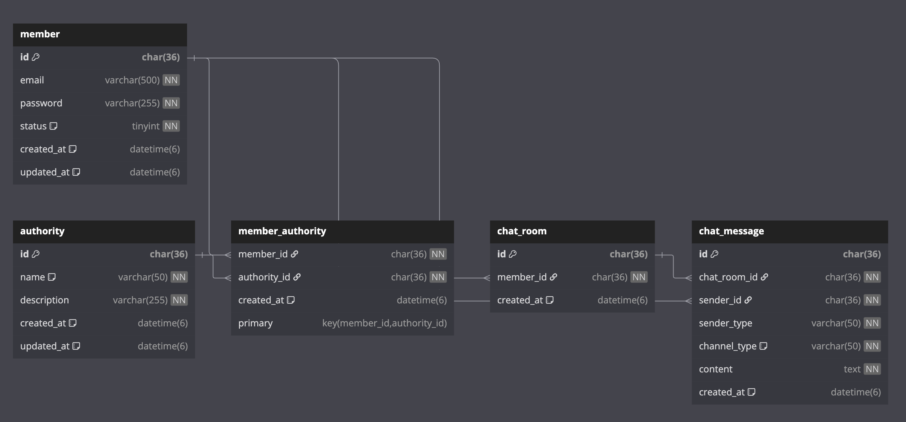
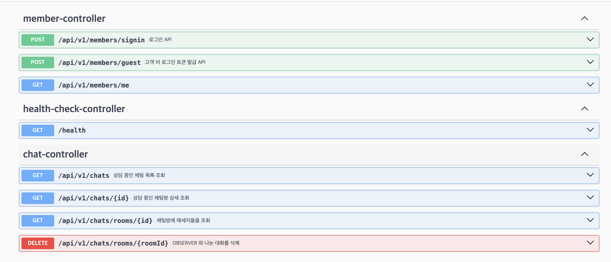
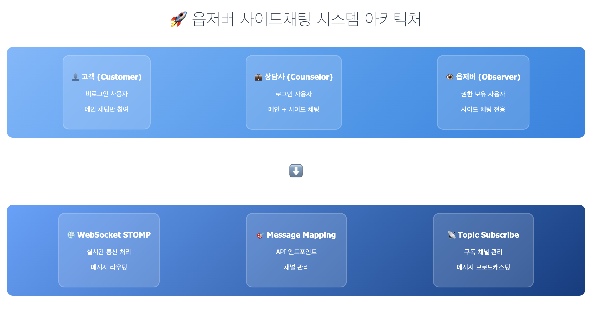
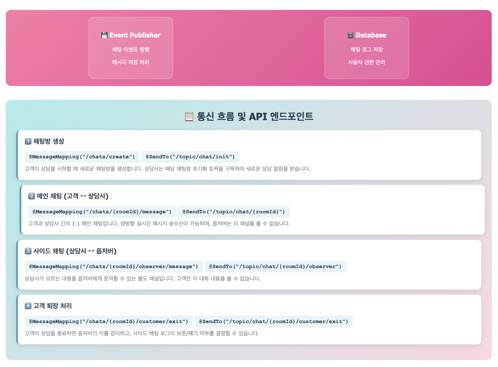

# 프로젝트 이름

> 고객과 상담가가 실시간으로 채팅할 수 있는 채팅 서비스

---

- 데모 동영상 링크
https://www.youtube.com/watch?v=pUnar-1xMh8

### 요구 사항
- 고객과 상담사가 실시간으로 채팅
- 상담사랑 옵저버와 별도로 실시간 채팅할 수 있는 별도 채널 존재
- 고객이 상담 종료 시 옵저버가 상담가랑 대홰내용 보존 / 폐기 선택 가능

## 🖼️ ERD (Entity Relationship Diagram)

> 전체 ERD는 아래 이미지 혹은 `/docs/erd.png` 파일 참조

## 🖼️ API 설명서

## 🛠️ 기술 스택

| 분류         | 기술 스택 |
|--------------|-----------|
| Language     | Kotlin (1.9.25) / Java(21) / Typescript(4.9.5) |
| Framework    | Spring Boot(3.5) / React(11.14.0) | 
| Database     | MySQL 8.0 version / |
| Documentation| Swagger (springdoc-openapi) |
| Real-time Communication | WebSocket STOMP |
| AI Agent / LLM | Cursor (1.0.0) / Chat GPT-4o |

---

### AI 의존도
- client - Cursor 이용하여 코드 작성 (90% Cursor 가 코드 작성)
- server - Chatgpt 도움 받음 (50% 정도 Chatgpt 코드 작성)